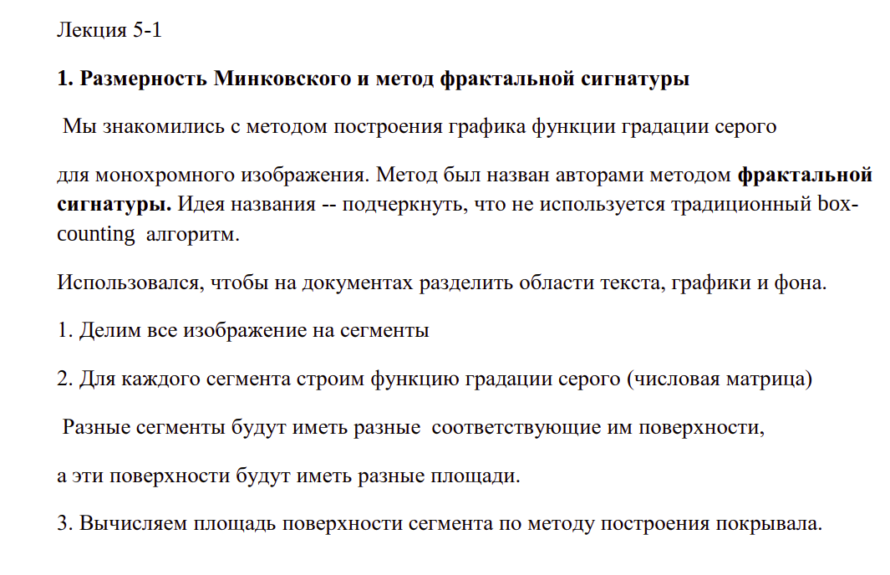
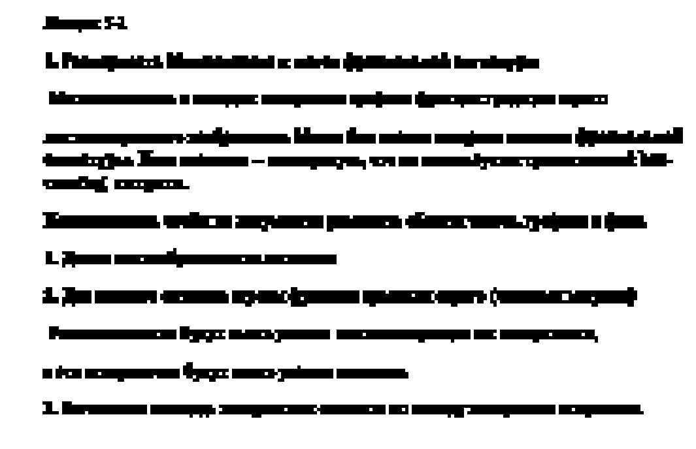

# Лабораторная работа №5. Постройка сегментации изображения на основании вычисления площади поверхности сегмента

Предлагаемая программа строит сегментацию изображения на основании вычисления площади поверхности сегмента

## Пример

### До обработки

### После обработки

