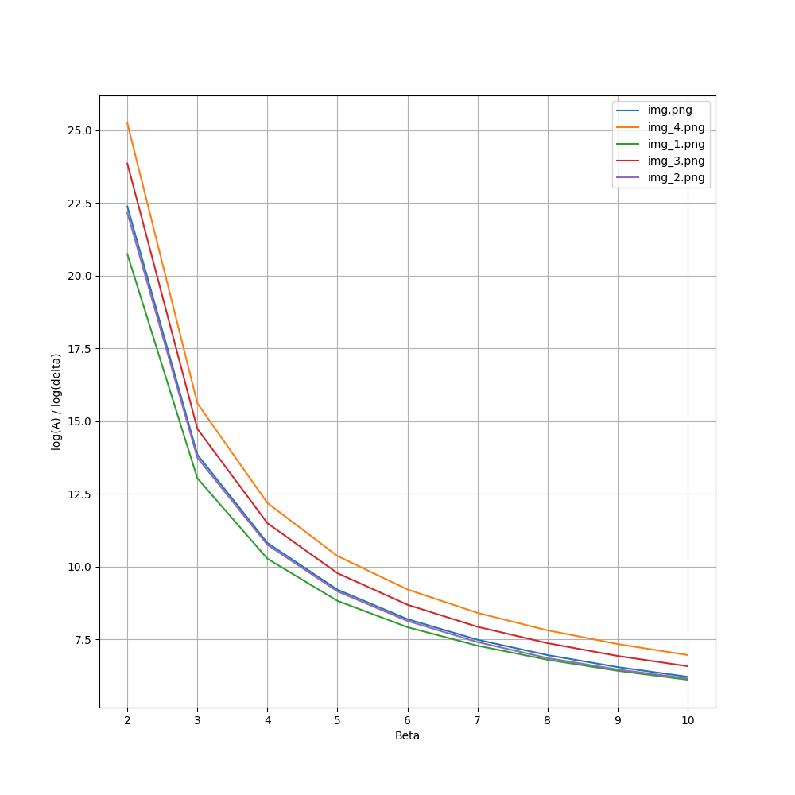

# Лабораторная работа №6. Вычисление вектор значений A_delta / ln delta (delta=1..10)

Предлагаемая программа вычисляет вектор значений ln A_delta / ln delta (delta=1..10) (Можно использовать как
симметричный так и ассиметричный метод)

## График

