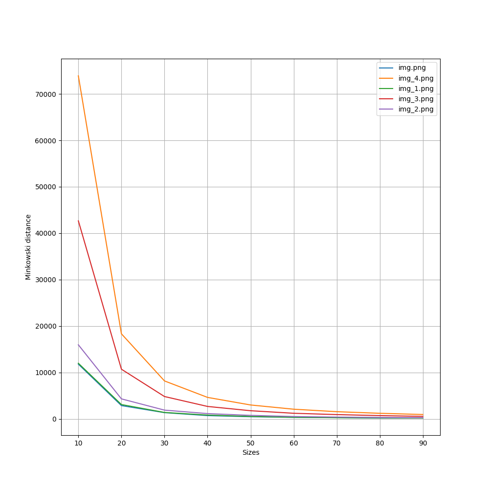

# Лабораторная работа №6. Вычисление вектора размерностей Минковского для выбранного изображения при изменении размера ячейки разбиения

Предлагаемая программа вычисляет вектор размерностей Минковского для выбранного изображения при изменении размера ячейки
разбиения

## График

